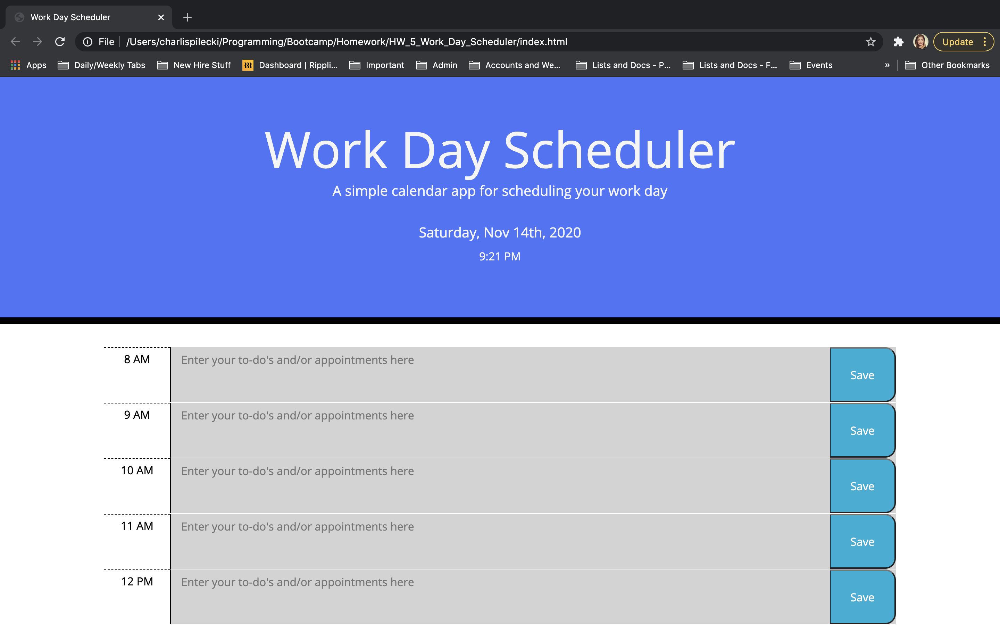
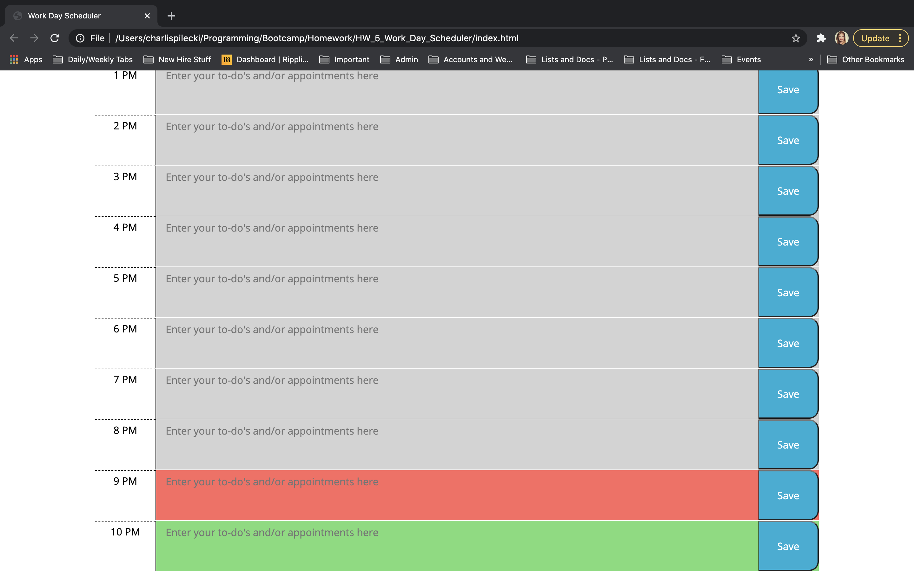

# HW_5_Work_Day_Scheduler

## About This Assignment
For this project, I worked with HTML, CSS (including Bootstrap), and Javascript (including JSON, JQuery, moment, local storage, etc.) to create a planner that will allow the user to plan out their work day. At the top of the jumbotron, the current date and time are displayed for convenience. For each hour of the standard work day, the user is able to enter in appointments or to-do items. They are then able to save those items to local storage. The planner is color coded so that past hours are greyed out, the current hour time block is red, and the future hour time blocks are green. The planner will reset with each new day, providing a clean slate for the user. 

## Screenshots

## Links
